<p align="center">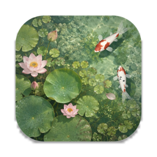</p>

<h1 align="center">碧池观鱼</h1>

<p align="center">一方碧潭作桌面：锦鲤悠游、云影掠过、雨打荷叶，轻点一下就来抢食。<br>
macOS · Windows · Android 动态壁纸，也能在浏览器和 Wallpaper Engine 里运行。</p>

<p align="center"><a href="https://github.com/moli-xia/fishwallpaper/releases/latest"><b>⬇ 下载最新版本</b></a></p>

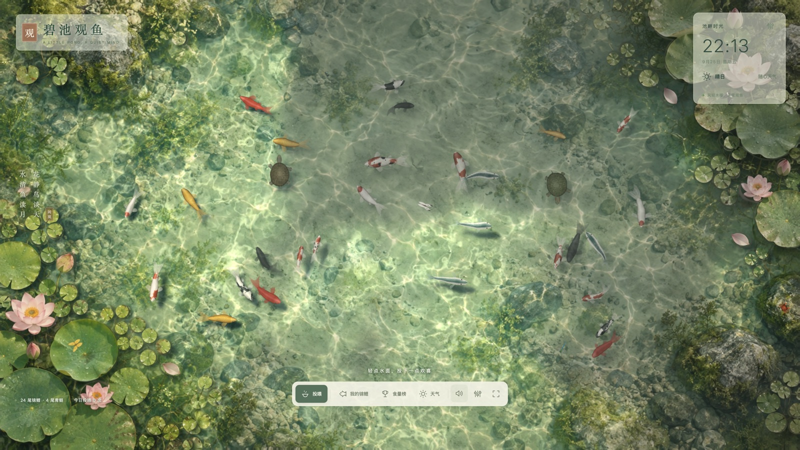

| 多云：云影移过，遮住处变暗、移走后阳光和焦散回来 | 雨天：荷叶积水、水珠、雨雾与涟漪 |
| --- | --- |
| 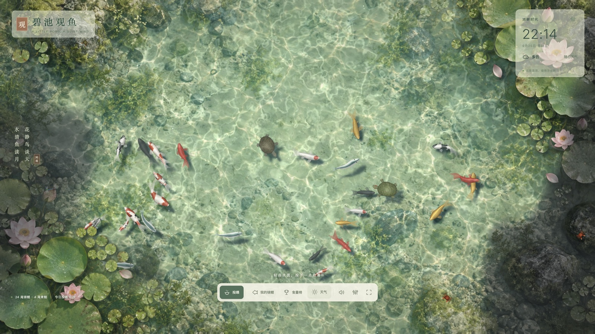 | 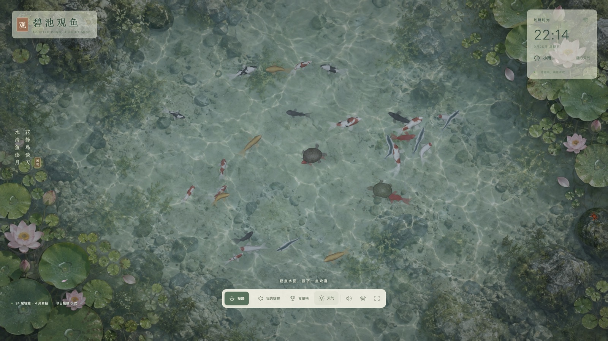 |
| 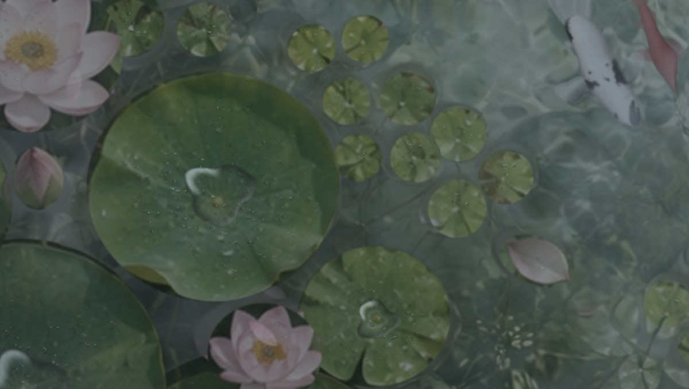 | 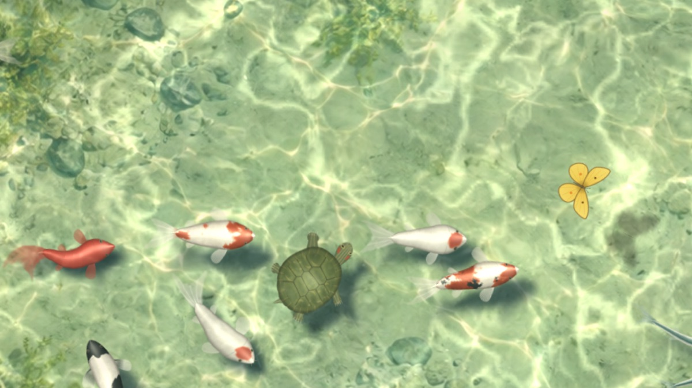 |
| 雨中荷叶：叶心积起的一汪雨水、珠状水滴 | 晴天：鱼和乌龟在池底投下青绿色的影子 |

| 七种锦鲤花色与青鲢（逐片鳞片、圆钝的头部） | 池边石头上的小螃蟹 |
| --- | --- |
| 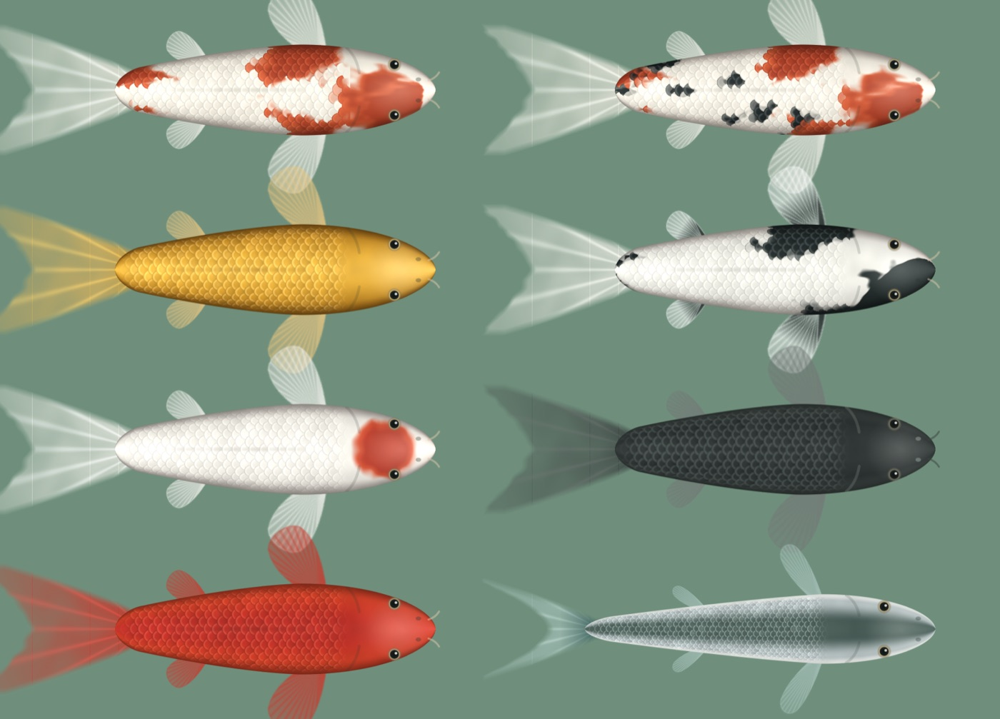 | 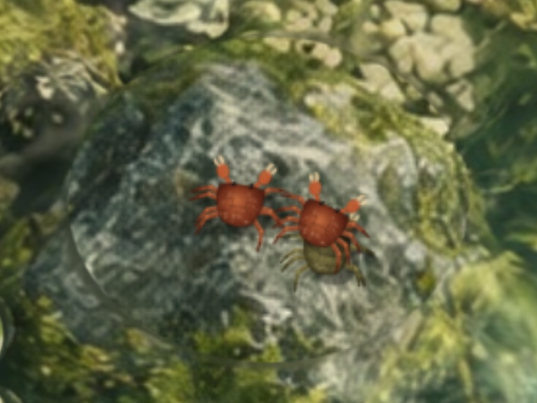 |

| 安卓桌面：轻点空白处投喂 | 安卓桌面：雨天 | 设为动态壁纸 | 应用内天气面板 |
| --- | --- | --- | --- |
| 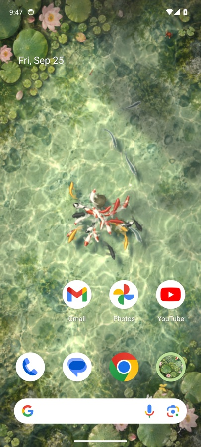 | 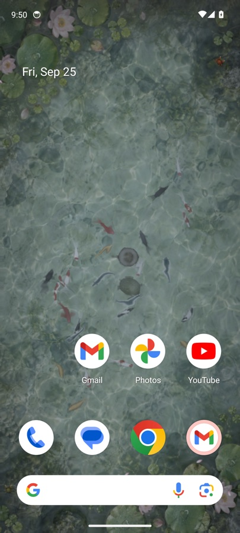 | 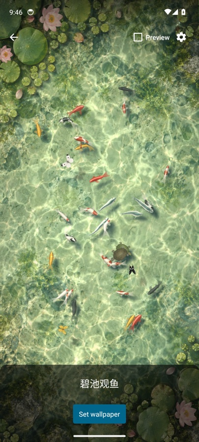 | 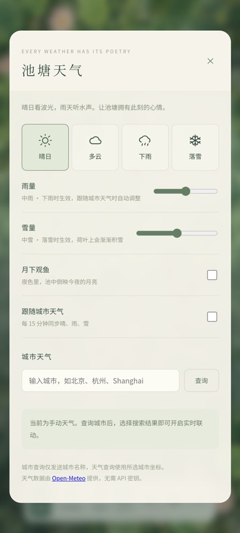 |

## 下载

在 [Releases](https://github.com/moli-xia/fishwallpaper/releases/latest) 下载对应平台的安装包：

| 平台 | 文件 | 说明 |
| --- | --- | --- |
| macOS 12+（Apple 芯片） | `BichiKoiPond-<版本>-macOS.dmg` | 打开后拖进「应用程序」，双击运行，池塘即成为每块屏幕的桌面背景；菜单栏 🐟 控制。首次打开请右键 →「打开」（未经 Apple 公证） |
| Windows 10 / 11 | `BichiKoiPond-<版本>-Windows.zip` | 解压整个文件夹，运行 `BichiPond.exe`；通知区域锦鲤图标控制。若提示“已保护你的电脑”，点“更多信息 → 仍要运行” |
| Android 7.0+ | `BichiKoiPond-<版本>-Android.apk` | 安装后第一次打开即进入动态壁纸预览，点「设置壁纸」 |
| 浏览器 / Wallpaper Engine | `BichiKoiPond-<版本>-Web.zip` | 解压后打开 `index.html`，或在 Wallpaper Engine 中导入该文件夹 |

iPhone：iOS 不允许第三方应用提供动态壁纸，因此没有 iPhone 版本；可以在 Safari 中打开网页版全屏观赏。

> 本项目根据一段[抖音视频](https://www.douyin.com/video/7688973095907232741)独立实现，非原作者官方作品；画面、代码与声音均为独立制作（见文末「素材与服务」）。

## 本地运行与开发

纯 HTML、CSS、WebGL2 和原生 JavaScript，无运行时依赖，不需要安装 npm 包；不支持 WebGL2 的环境自动退回 Canvas 2D。直接双击 `index.html` 可体验池塘；推荐通过本地服务运行，以获得稳定的本地存档和城市天气查询体验：

```sh
npm run dev
# 或
node scripts/serve.mjs
```

打开 <http://localhost:5173>。默认仅监听本机，`PORT=8080 npm run dev` 可更改端口。

## 已实现

- 水面：GPU 波动方程模拟涟漪（点击、投喂、雨点、鱼吻水面、乌龟换气、蜻蜓点水都会激起水波并互相干涉），折射水底与游鱼，动态焦散光网，细碎的太阳波光，天空反光。
- 云影：成团的云影随风飘过池面并缓慢变形。云影遮住之处水色转暗、偏冷偏灰，焦散、波光、鱼身高光随之消失，鱼影变淡变柔；云影移走，阳光、焦散与清晰的鱼影随即回来。多云时约半池云影、明暗交替；晴天偶有小片云影；雨天满天阴云。荷叶、石头、蝴蝶的影子同样受云影明暗影响。
- 鱼影：锦鲤、青鲢、鳍与乌龟在池底投下清晰的影子，水吸收红光使影子呈青绿色；贴底的鱼影子深而锐利、靠得近，浮在水面的鱼影子偏远、更柔和。
- 浮于水面的荷叶、荷花、花苞、铜钱草和出水的石头：按底图逐个标注并自动贴合边缘，从底图中切出单独绘制，不参与折射、焦散和波光，向水底投下阴影。荷叶随水漂动，铜钱草、花苞和荷花在茎上摇曳，风雨时摆得更明显，涟漪经过时会被推动；雨天被雨点打中时溅起水花并颤动，荷叶湿润后颜色更深，叶面挂满会反光的水珠，大荷叶中央积起一汪随叶倾斜晃动、不时泛起小圈涟漪的雨水，石头湿润发暗、雨水沿石面流下并映出天光；下雪时荷叶和石头上渐渐积起斑驳的雪，雪停后慢慢化去；涟漪遇到它们会被挡回，锦鲤可以从荷叶下游过。
- 锦鲤：程序化绘制的俯视贴图，含红白、大正三色、黄金、白写、丹顶、墨鲤、纯红七种花色。体形按真鱼俯视轮廓：圆钝的吻部明显窄于身体，最宽处在胸鳍与背鳍前端（约身长五分之二处），再收向粗壮的尾柄。每片鳞都有被前一片压住的暗色鳞袋、靠近游离缘的亮带和一道细细的鳞缘线，位置略有错落、色调各不相同，纯红、黄金、墨鲤这类纯色鱼也能看出一片片鳞；纯红背脊深红、两侧转为朱红，墨鲤是黑色鳞袋上罩着浅色鳞网。鳞片随身体弧度排布，花纹后缘沿鳞片呈扇贝状（kiwa）、前缘柔和（sashi），红斑中心深边缘浅；黄金锦鲤为温润的山吹黄金，墨鲤近乎哑光。身体按圆柱体实时受光，向阳一侧更亮，高光随转身移动。
- 游动：身体沿"头部带动的脊柱"弯曲，加速—滑行的节奏、平滑转向、结伴同游、互相避让、上浮下沉（越深越模糊、影子越近）、胸鳍随速度收放并在转弯时内侧张开；追食时减速对准，食物落在身下会先游开再绕回。
- 青鲢：4 条常驻池塘，瘦长鱼身、深青色背脊、银白侧身与白色腹缘，细尾柄连接深叉尾，胸腹鳍更窄；转向响应更快，后半身弯曲更灵活，以轻快的小幅摆尾加速和滑行，与锦鲤一起避让和受惊，松散结群巡游，不争抢投喂颗粒，也不占锦鲤名额或进入锦鲤食量榜。已有存档打开后也会出现。
- 24 尾初始锦鲤，点击投喂，一次 9 粒；鱼食漂浮、有上限和过期时间，入水溅起涟漪。「投喂」关闭时轻点水面会惊走附近的鱼。
- 创建锦鲤、调整大小与花色、随机花纹、手绘花纹、命名与改名、放生（二次确认，至少保留一尾）；最多 60 尾。
- 累计食量排行榜；名字、手绘花纹、进食数据、每日投喂次数、设置自动保存在浏览器。
- 小螃蟹：红褐色的溪蟹和橄榄色的相手蟹，住在露出水面的石头和池边苔岸上。横着走、歇脚时举着螯、偶尔挥一挥；轻点附近时会飞快跑向水边钻进水里，过一会儿从别处冒出来。下雪时躲着不出来，可在设置中关闭。
- 小乌龟：四肢交替划水、歇息时探头张望、定时浮上水面换气；晴天蝴蝶（粉蝶、黄蝶、凤蝶）会停在荷花和荷叶上歇脚；红蜻蜓或碧伟蜓在晴天和多云时疾飞、悬停、停在荷花苞上、点水；夜晚换成萤火虫；荷花瓣在水面漂浮。
- 晴、多云、雨、雪，雨量与雪量可调（跟随城市天气时按实际降水、降雪量调整），切换时平滑过渡。雨丝分远近层次，雨点落水溅起小水花，池面飘过低低的雨雾；大雨时偶有闪电照亮池塘，雷声随后滚来（开启声音时；系统“减弱动态效果”时不闪电）。雪花分远近层次，随风飘移，落水后融化并泛起细纹。
- 月下观鱼：池中倒映今夜真实月相的月亮，随水波碎开摇曳；月光照亮整池波纹，碎光粼粼，偶见星影。
- 查询并明确选择城市后使用 Open-Meteo 实时天气，每 15 分钟更新。失败时保留原天气并提示，不伪造温度。
- 声音（全部由 Web Audio 实时合成，无音频文件，默认静音），总音量与各项音量分别可调：
  - 水声：溪流潺潺、山泉叮咚、叠水瀑声、池水轻漾、竹筒惊鹿，或关闭。
  - 天气环境音（不含水声、风声）：晴天鸟鸣与斑鸠；多云稀疏鸟鸣与布谷；雨天为雨声与雨滴落入池塘的叮咚声，随雨量变密，大雨时闪电过后传来雷声；雪天偶闻寒鸦；夜里虫鸣与蛙声。
  - 禅意音乐：古琴（拨弦模型、五声音阶、带滑音与泛音）、颂钵、风铃或关闭。
  - 互动水声：投喂、吞食、轻点水面。
- 30 / 60 帧模式、后台停止动画、移动端布局、键盘和沉浸模式。

## 操作

| 操作 | 效果 |
| --- | --- |
| 点击水面 | 投喂，或泛起涟漪并惊走附近的鱼（切换「投喂」按钮） |
| 我的锦鲤 | 选择花色、手绘花纹、命名后放入池塘；在列表中改名 |
| 食量榜 | 查看真实累计吃到的鱼食数量 |
| 天气 | 手动切换天气、月色，或查询并选择城市 |
| H | 隐藏 / 显示界面 |
| Esc | 关闭面板 / 退出沉浸 |
| 空格 | 水面获得焦点时，在中央投喂 |

手绘时开启「手绘花纹」，选择画笔颜色，直接在预览鱼身上涂画；「清除」仅清除手绘笔触。存档按浏览器与来源隔离，`file://`、`localhost`、不同端口和 Wallpaper Engine 的存档互不共享。

## Wallpaper Engine

```sh
npm run build
```

构建结果位于 `dist/`，包含静态文件和 `project.json`。在 Windows 的 Wallpaper Engine 壁纸编辑器中选择「创建壁纸」，打开 `dist/index.html` 并保持其余文件的相对路径；如需直接打开项目，使用包含 `project.json` 的构建目录。

已经接入 `wallpaperPropertyListener`，支持宿主暂停与天气、雨量、雪量、速度、界面显隐、声音开关、水声开关与种类、天气环境音、禅意音乐和总音量属性。自定义属性定义在 `project.json`；若导入向导新建了项目配置，可在编辑器「更改项目设置」中重新添加 `weather`、`rainamount`、`snowamount`、`speed`、`showui`、`sound`、`water`、`watertype`、`weathersound`、`music`、`volume` 属性。

Wallpaper Engine 版本未在 Windows 宿主内运行验证。macOS 请使用下方的原生桌面壁纸应用，它不会改动系统壁纸设置，退出后桌面即恢复原样。

## 检查与构建

```sh
npm test
npm run build
```

测试覆盖：追食和单次记账、食物落在身下也能吃到、长时间边界稳定性、游动姿态与体长、受惊逃离、避开荷叶、鱼食上限与过期、天气映射、异常存档清洗、手绘花纹持久化、纯红花色存档与像素颜色、青鲢混游与体形、各天气画面参数一致与云量、雨打荷叶的水花与颤动回稳、大雨闪电与雷声事件。

`npm run build` 只替换 `dist/` 中的网页文件，不会删除其中的 macOS 应用、磁盘映像和 APK。

主要文件：

| 文件 | 内容 |
| --- | --- |
| `core.js` | 游动仿真（转向、加速滑行、避让、追食、脊柱）与存档逻辑，可在 Node 中测试 |
| `art.js` | 锦鲤、鳍、乌龟、蝴蝶、花瓣等贴图的程序化绘制 |
| `gl.js` | WebGL2 渲染：涟漪模拟、焦散、阴影、折射合成、精灵批量绘制；Canvas 2D 退回方案 |
| `scene.js` | 乌龟、蝴蝶、蜻蜓、萤火虫、花瓣、雨雪与天气光照，锦鲤的鳍和阴影；底图中浮于水面之物的标注与遮罩 |
| `audio.js` | 环境声、禅意音乐与互动水声的合成与调度 |
| `app.js` | 界面、面板、天气服务、主循环 |
| `assets/pond.jpg` | 池塘底图；`assets/pond-data.js` 是同一张图的内嵌版本，由 `scripts/embed.mjs` 生成，让直接双击打开时 WebGL 也能读取 |

更换底图后运行 `npm run build`（或 `node scripts/embed.mjs`）重新生成内嵌版本。

发布到 GitHub（创建公开仓库、推送代码，并把 `dist/` 中的各平台安装包发布为 Release）：

```sh
gh auth login              # 首次使用时登录
./scripts/publish-github.sh
```

## 素材与服务

池塘底图使用内置 imagegen 生成（`assets/pond.png` 为原图，`pond.jpg` 为压缩后的运行版本）；锦鲤、小乌龟、蝴蝶、蜻蜓、水波、焦散与雨雪均由代码绘制，所有声音由代码合成。更换底图时需同步修改 `scene.js` 中 `FLOATERS` 的荷叶与荷花标注。没有提取原视频的图片、代码或音频。生成提示词见 [assets/ARTWORK.md](assets/ARTWORK.md)。本项目为独立复刻，非原作者官方版本，画面素材与部分布局存在差异。

天气服务：[Open-Meteo](https://open-meteo.com/)，[地理编码文档](https://open-meteo.com/en/docs/geocoding-api)。公共免费接口主要面向非商业使用，商业发布前请按其现行条款配置服务。

壁纸宿主接入参考：[Wallpaper Engine 官方文档](https://docs.wallpaperengine.io/en/web/api/propertylistener.html)。

## macOS 动态壁纸应用

```sh
./scripts/build-macos.sh
```

生成 `dist/碧池观鱼.app`（约 4MB）和可拖拽安装的 `dist/碧池观鱼-<版本>.dmg`（当前 1.2.0），支持 macOS 12 及以上。构建工具链仍能链接 Intel 时生成通用二进制；当前机器的 macOS 27 SDK 已不含 x86_64 的 Swift 运行库，因此产物为 Apple 芯片（arm64）版本。应用为临时（ad-hoc）签名，首次在其他 Mac 上打开时需右键 →「打开」。

双击打开后，池塘即铺满每块屏幕的桌面背景层——位于系统壁纸上、桌面图标下，不影响正常使用桌面；多显示器与空间切换均支持。

壁纸上的底栏、天气卡可以直接点击。访达的桌面窗口（放桌面图标、拖选框的那一层）盖在壁纸之上，会截走所有点击，所以应用在普通窗口之下、桌面图标之上另放一层透明的“点击层”：鼠标移到池塘的控件上时它才接住点击并转交给壁纸，移开后点击照常落到桌面、图标和小组件上。打开面板（我的锦鲤、天气、设置等）时，壁纸整体升到桌面图标之上并接收键盘，起名、查城市可正常输入（含中文输入法）；关闭面板后回到桌面层。

菜单栏 🐟 图标：

- 打开交互窗口（⌘I）：完整的池塘窗口，打开期间应用出现在程序坞与 ⌘-Tab 中，支持 ⌘C / ⌘V / ⌘A / ⌘W。
- 天气：晴日、多云、下雨、落雪、月下观鱼，当前天气带勾选。
- 暂停壁纸动画（⌘P）：省电；显示器睡眠或切换到其他用户时也会自动暂停。
- 重载桌面壁纸（⌘R）、登录时启动（macOS 13+）、退出。

所有窗口（每块屏幕的壁纸与交互窗口）实时同步：在任一处改名、添加或放生锦鲤、切换天气与声音设置，其他窗口立即跟随，以最近一次修改为准；进食数量取各窗口中的较大值。底部控制栏会自动避让程序坞高度。

自检：`BICHI_SELFTEST=<输出目录> "dist/碧池观鱼.app/Contents/MacOS/BichiPond"` 会自动走一遍菜单操作（打开交互窗口、切换天气、改名同步、暂停与恢复、关闭窗口），逐项输出 PASS / FAIL 与帧率，把各阶段的壁纸截图存入该目录，完成后恢复原设置并退出。

## Windows 桌面动态壁纸

```sh
./scripts/build-windows.sh
```

生成 `dist/碧池观鱼-Windows-<版本>.zip`（约 2MB，当前 1.2.0）。需要 .NET SDK 8 或更高版本（可在 macOS / Linux 上构建；本机装在 `~/.dotnet`，或用 `DOTNET` 指定路径）。程序基于 .NET Framework 4.8 与 WebView2（Edge 内核），二者都是 Windows 10 / 11 自带，用户无需另外安装任何东西；若 Windows 10 缺少 WebView2，程序会提示并打开下载页。

使用：解压整个文件夹，双击 `BichiPond.exe`。池塘铺满每块屏幕的桌面背景，位于桌面图标之下（兼容 Windows 11 24H2 起改变的桌面层结构），不影响正常使用桌面。

- 在桌面空白处轻点：锦鲤游过来抢食（程序只“旁听”鼠标，不拦截任何点击）。壁纸上不显示按钮。
- 通知区域的锦鲤图标（右键）：打开交互窗口（投喂、起名、天气、声音、设置）、切换天气与月下观鱼、暂停壁纸动画、重载、开机时启动、退出；双击图标打开交互窗口。交互窗口里的改动即时同步到桌面壁纸。
- 某块屏幕被最大化或全屏的窗口挡住、或锁屏时，这块屏幕的池塘停止绘制。
- 资源管理器重启或显示器变化后自动重建壁纸；退出后桌面恢复为原来的系统壁纸。
- 数据和出错日志保存在 `%LOCALAPPDATA%\BichiPond`。

验证范围：可执行文件、清单（按显示器 DPI 感知）、图标、WebView2 加载器（x86 / x64 / ARM64）均已检查，编译时警告视为错误且零警告；这台 Mac 上没有 Windows 环境，尚未在 Windows 上实际运行。首次运行时 Windows 可能提示“已保护你的电脑”（未签名程序），点“更多信息 → 仍要运行”。

## 安卓动态壁纸（APK）

```sh
./scripts/build-android.sh
```

生成 `android/build/碧池观鱼.apk`，并复制到 `dist/碧池观鱼.apk`（约 1.9MB，版本 1.2.0；需 `~/android-build` 下的 JDK 17 与 Android 构建工具，见脚本头部说明）。脚本每次都从当前网页源码重新拷贝资源，并沿用同一把签名密钥，新版本可直接覆盖安装，池塘里的锦鲤和设置都会保留。需要 Android 7.0（API 24）及以上。

这是**手机桌面的动态壁纸**：池塘就在主屏幕（及系统允许时的锁屏）背景里游动，应用图标和小部件浮在水面上。

- 安装后第一次点开图标，会直接进入系统的动态壁纸预览，点「设置壁纸」即可；以后也可以在应用设置里点「设为壁纸」，或在系统「壁纸」设置里选择动态壁纸「碧池观鱼」。
- 轻点桌面空白处投喂，锦鲤聚过来抢食；左右滑动翻页不会投喂。
- 壁纸上不显示任何按钮；点应用图标（或壁纸预览里的「设置」）打开完整的池塘，可投喂、给锦鲤起名、切换天气与声音。改动会立即同步到桌面壁纸。
- 桌面被应用挡住或熄屏时完全停止绘制，不耗电；显示时以 60 帧、按屏幕原生分辨率绘制（最高 3 倍像素密度）。设备跟不上时分两级自动降低精度（不低于 1 倍），页面每分钟在日志里记一行帧率与分辨率（`adb logcat | grep "\[pond\]"`）。
- 竖屏时池塘底图转四分之一，整方池塘（包括两侧的荷花丛与石头）铺满屏幕。

实现：系统只给动态壁纸一块绘图表面（Surface），WebView 不能直接画进去；应用用这块表面建一个私有虚拟显示器，把池塘网页放在这个显示器上的 Presentation 窗口里，由 GPU（含 WebGL）直接渲染成壁纸。

验证：已在 Android 14 模拟器（Pixel 6，WebView 113，主机 GPU）上安装并设为桌面与锁屏壁纸，确认池塘在主屏幕上以 60 帧、1082×2402 原生分辨率实时渲染，轻点空白处投喂、滑动不投喂，应用里切换下雨后桌面随之下雨，被应用遮挡时 CPU 占用降为零。

安装：把 APK 传到手机（隔空投送不可用于安卓，可用网盘/USB/局域网），点开安装并允许「安装未知来源应用」。
